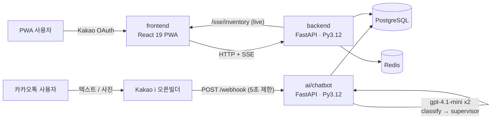
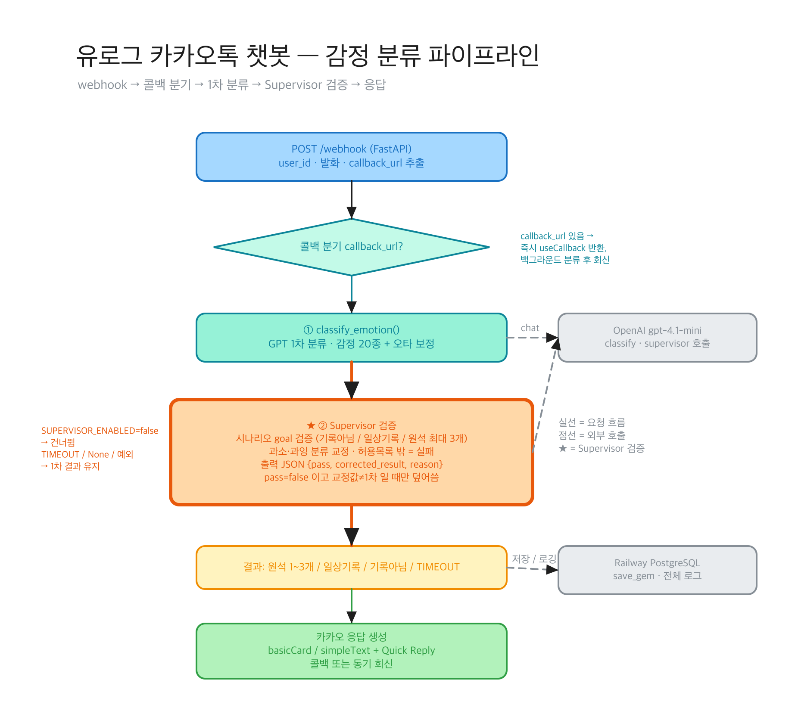
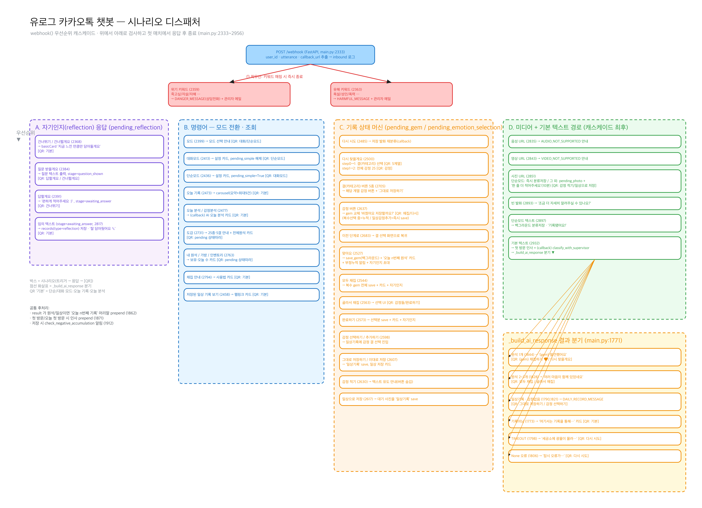
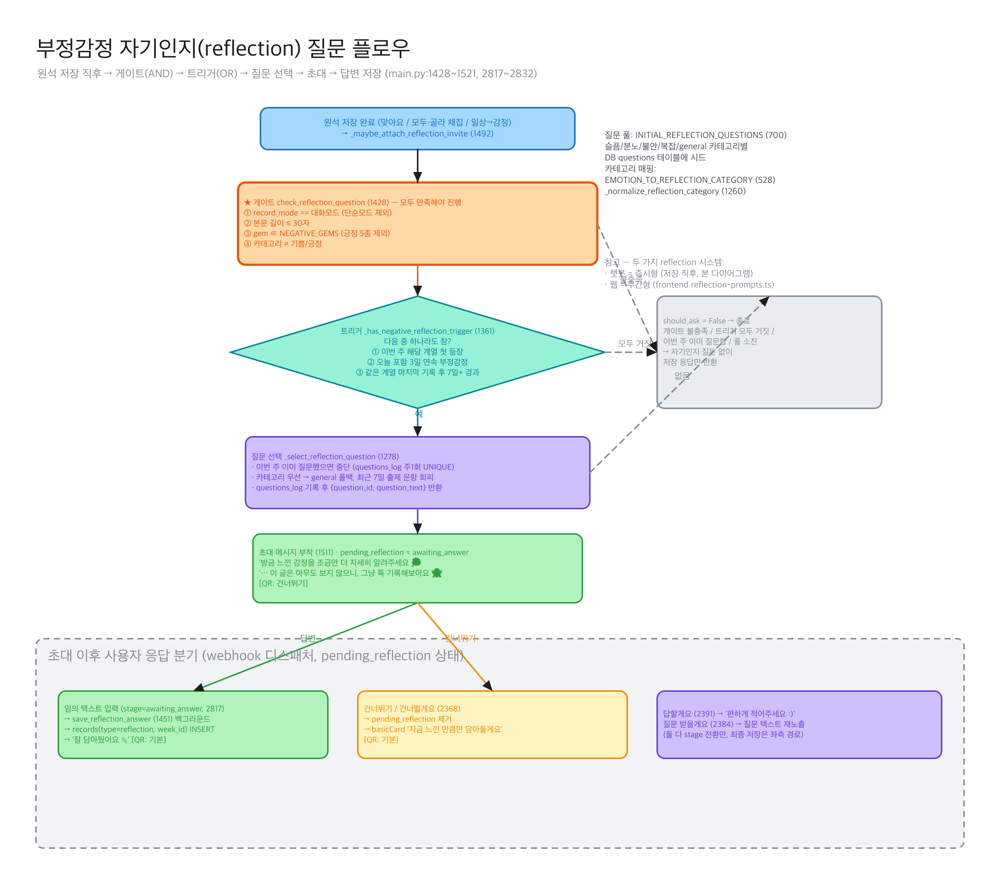
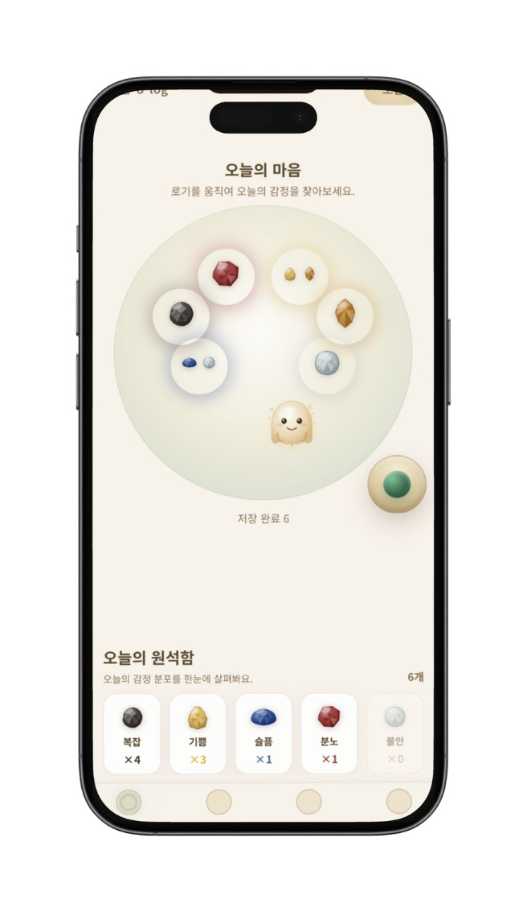
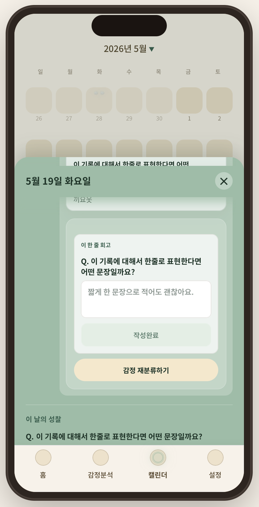
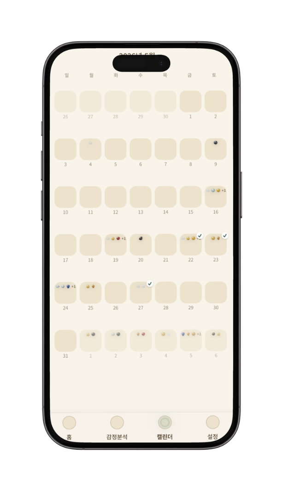
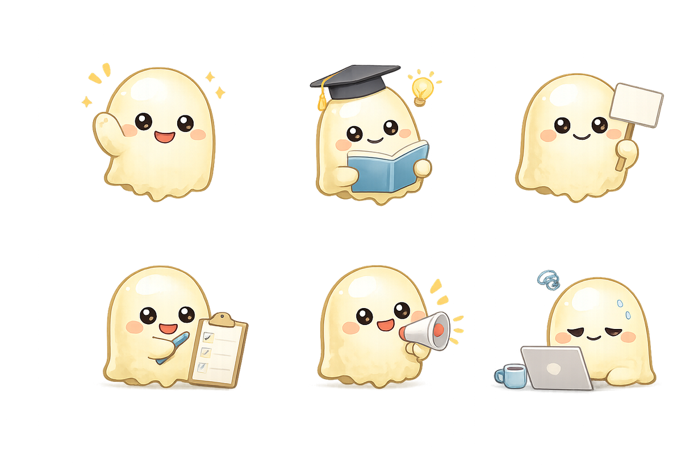

# 유로그 (Ulog)

**U + log — "당신의 하루가 그냥 지나가지 않도록."** 카카오톡으로 하루의 감정을 채집하고, AI가 세공한 감정 원석으로 돌아보는 청년 감정인지(emotional-awareness) 서비스.

> 한양대학교 × 카카오테크포임팩트 · 2026

<p align="center">
  
  
  
  
  
  
  
  
</p>

---

## 📖 프로젝트 여정

이 README는 **기술 문서**입니다. 사회혁신 **기획 · 문제정의 · 실험 설계 · 유저스터디 결과**까지의 전체 여정은 아래 포트폴리오에 정리되어 있습니다.

> 🔗 **[Notion 포트폴리오 — 유로그(Ulog) 사회혁신 프로젝트 여정](https://app.notion.com/p/38c1d0fae2de8132a60adaf04f1cf1d2)**

---

## 📄 Project Overview

[](docs/portfolio-assets/video1.mp4)

유로그(Ulog)는 **"힘든 건 아는데 뭐 때문인지 모르겠다"** 는 청년의 감정인지 결여 문제에서 출발했습니다. 기록 앱들이 실패하는 두 장벽 — ① 기록이 귀찮다, ② 기록이 뭘 돌려주는지 모른다 — 를 동시에 풀기 위해, 별도 앱 설치 없이 **카카오톡에서 마스코트 '로기'에게 하루를 툭 던지듯 말하면** AI가 감정을 분류해 **감정 원석**으로 돌려주는 게임화 아카이빙을 설계했습니다. 분류는 `gpt-4.1-mini` 2단계(classify → supervisor) 파이프라인이 수행하고, 사용자는 PWA 웹앱에서 원석을 확인·세공하며 캘린더 회고와 주간/월간 감정 분석으로 자신의 감정 패턴을 인지하게 됩니다. *아보하(Avoha)라는 이름으로 시작해 유저스터디를 거쳐 유로그(Ulog)로 리브랜딩·피벗한 프로젝트입니다.*

**1주 유저스터디(n=16) 핵심 결과:**

| 지표 | 결과 | 비고 |
|---|---|---|
| AI 감정분류 정확도 | **41.7% → 97.3%** | 동일 잣대(사용자 정정), 수정률 2.7% |
| 감정인지 (사전→사후) | **3.60 → 3.90** | Cohen's d = 0.81 (탐색적) |
| 사용성 (SUS) | **71.25** | 업계 평균 68 상회 |
| 회고 만족도 | 캘린더 **3.77** > AI 분석 3.36 | "분석"보다 "회고" → 피벗 근거 |

> **핵심 통찰:** *"AI가 못 맞추는 게 아니라, 사용자가 다음 단계로 안 넘어온다."* — 병목은 모델이 아니라 **전환·습관 형성**.

## 🎥 Video

| 컨셉 영상 | 챗봇 기록 | 홈 · 오늘의 마음 | 캘린더 회고 | 감정 분석 |
|:---:|:---:|:---:|:---:|:---:|
| [▶ video1](docs/portfolio-assets/video1.mp4) | [▶ video2](docs/portfolio-assets/video2.mp4) | [▶ video3](docs/portfolio-assets/video3.mp4) | [▶ video4](docs/portfolio-assets/video4.mp4) | [▶ video5](docs/portfolio-assets/video5.mp4) |

---

## Architecture





> ⚠️ **설계 vs 배포.** 초기 설계는 Node(Fastify · Drizzle · BullMQ · Gemini) 스택이었으나, **실제 배포된 시스템은 Python(FastAPI · SQLAlchemy · OpenAI)** 입니다. 이 **Node → Python 피벗**(라이브 DB 위 무중단 ORM 스왑 포함)이 이 프로젝트에서 가장 값진 엔지니어링 스토리입니다.

---

## System Workflow

1. 사용자가 카카오톡에서 챗봇 **'로기'** 에게 하루의 순간을 보냅니다 (단순/대화 모드).
2. Kakao i 오픈빌더가 `POST /webhook` 호출 → `callbackUrl` 확인 즉시 `{useCallback: true}` 반환으로 **5초 제한을 우회**하고 백그라운드 분류로 전환합니다.
3. `classify_emotion()` — `gpt-4.1-mini` 1차 분류: 최대 3개 감정 / `기록아님` / `일상기록` 판별.
4. `supervisor_check()` — 2차 검증 노드가 과소·과잉 분류를 교정합니다 (실패·타임아웃 시 1차 결과로 graceful fallback).
5. 감정 원석이 PostgreSQL에 저장되고, 모든 LLM 호출은 per-webhook `trace_id`로 상관 로깅됩니다 → WoZ 실행이 라벨링된 학습 코퍼스가 됩니다.
6. 분류 결과 카드가 카카오톡으로 콜백 회신됩니다 (원석 1~3개 + "웹에서 기록 보기").
7. PWA(React 19)에서 Kakao OAuth 로그인 → **오늘의 마음**에서 로기를 움직여 원석을 확인·세공합니다 (SSE 실시간 인벤토리).
8. **캘린더 회고 · 주간/월간 감정 분석 · 감정 리캡**으로 감정 패턴 자기인지를 강화합니다.

---

## Key Features

### 1) 카카오톡 챗봇 감정 채집 — 진입장벽 제로

- 별도 앱 설치 없이 **평소 쓰는 카카오톡**에서 기록 — "기록의 귀찮음" 장벽 제거
- 단순 모드 / 대화 모드 / 오늘 기록 / 오늘 분석 4가지 진입점
- `기록아님`·`일상기록` 자동 판별로 아무 말이나 던져도 안전한 대화 경험
- ▶ 데모: [챗봇 기록 영상](docs/portfolio-assets/video2.mp4)

### 2) AI 2단계 감정분류 파이프라인

- **25개 감정(챗봇 UX 어휘) → 5계열 → 10개 표준 감정코드(DB)** 의 2계층 택소노미
- ① `classify_emotion()` 1차 분류 → ② `supervisor_check()` 2차 검증이 과분류 교정 — 단일 저가 모델 `gpt-4.1-mini` · temperature 0
- 정확도 **41.7% → 97.3%** (사용자 정정 기준, 2차 수정률 2.7%)
- 부정감정 한정·빈도 제어된 **자기인지 질문 트리거**로 감정 언어화 유도

<details>
<summary>📐 상세 플로우 다이어그램 (시나리오 분기 · 회고 질문 트리거)</summary>
<br>


</details>

### 3) 감정 원석 세공 & 게이미피케이션 — "기록이 돌려주는 것"

| 홈 · 오늘의 마음 | 감정 원석 | 캐릭터 도감 | 원석 등급 |
|:---:|:---:|:---:|:---:|
|  |  |  |  |

- 기록이 **감정 원석**으로 돌아오고, 로기를 움직여 원석을 확인·세공 — SSE 실시간 인벤토리
- 도감·등급 시스템으로 수집 동기 부여
- ▶ 데모: [홈 영상](docs/portfolio-assets/video3.mp4)

### 4) 캘린더 회고 & 감정 분석

| 자기인지 질문 | 캘린더 회고 | 마스코트 '로기' |
|:---:|:---:|:---:|
|  |  |  |

- 날짜별 감정 원석과 기록 원문을 다시 만나는 **캘린더 회고** (만족도 3.77 — 최고점)
- 주간/월간 **감정 패턴 시각화 + 감정 리캡** ("웃음이 가장 많았던 순간이에요")
- ▶ 데모: [캘린더 영상](docs/portfolio-assets/video4.mp4) · [감정 분석 영상](docs/portfolio-assets/video5.mp4)

---

## Tech Stack

| 분류 | 스택 |
|---|---|
| **프론트엔드 (PWA)** — [`2_avoha/frontend/`](2_avoha/frontend/) | Vite 6 · React 19 · TypeScript · Tailwind v4 · Zustand · React Router 7 · Framer Motion · Recharts |
| **백엔드 (API)** — [`2_avoha/backend/`](2_avoha/backend/) | Python 3.12 · FastAPI · SQLAlchemy 2.0 (async) · asyncpg · Alembic · Pydantic · sse-starlette |
| **AI 챗봇** — [`2_avoha/ai/chatbot/`](2_avoha/ai/chatbot/) | Python 3.12 · FastAPI · psycopg2 · OpenAI `gpt-4.1-mini` |
| **데이터베이스** | PostgreSQL · Redis |
| **외부 연동** | Kakao i 오픈빌더 (챗봇 webhook · callback) · Kakao OAuth |
| **배포** | Railway (`intelligent-wholeness`) · NIXPACKS Python 3.12 핀 |

---

## 🙋 내 기여 (AI · 백엔드/인프라 리드)

> 임동현 — AI 감정분류 파이프라인 + 백엔드/인프라 전체. 팀의 기획·디자인·리서치를 기술로 번역하는 역할.

- **🤖 AI 파이프라인** — 25→10 감정 택소노미, 2단계 classify→supervisor 분류, 정확도 분석(41.7→97.3%), 자기인지 질문 트리거 로직, `gpt-4.1-mini` 프롬프트 설계.
- **⚙️ 백엔드/API** — FastAPI + SQLAlchemy 2.0(async), 데이터 모델(`gems`/`chatbot`/`events`/`kakao_messages` 등), SSE 실시간 인벤토리, 카카오 webhook 수집, Pydantic 계약·세션 인증.
- **🚂 인프라/배포** — Railway 3중 Python 3.12 핀(빌더 floating 문제 해결), 라이브 DB 위 무중단 ORM 스왑(`migrate.py` Alembic stamp), 정직한 데모 시딩(`seed_demo_records.py`), 분석 프라이버시(원문 미저장).
- **📊 데이터 분석** — `confirmed_emotion_code` prefill 함정 규명 → `web_reviewed_at` 기반 정직한 정확도 측정, 행동 로그(체류시간·재분류율) 인사이트.

---

## 📂 Repository Structure

```
kakao_impact/
├── 1_avoha/            1차 MVP 테스트 — 소확행 모바일 웹앱 (Vite + React 19)
├── 2_avoha/            유로그(Ulog) — 메인 프로젝트
│   ├── frontend/       PWA 프론트엔드 (React 19)
│   ├── backend/        FastAPI + SQLAlchemy + Postgres + Redis  ← 라이브
│   ├── ai/chatbot/     카카오 챗봇 (FastAPI + gpt-4.1-mini)     ← 라이브
│   ├── design/         디자인 에셋
│   └── ops/            운영 콘솔 + 스크립트
└── docs/               아키텍처 · 분석 문서 · 포트폴리오 자산
```

---

## License

Proprietary — 프로젝트별 라이선스 정책은 각 하위 디렉토리를 참조하세요.
