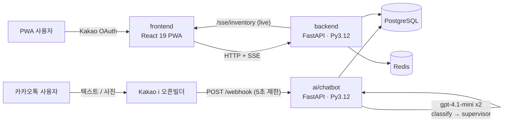

# 아보하 (Avoha) · 하루보석 💎

> **카카오톡 기반 청년 감정인지(emotional-awareness) 솔루션** — "아무 일 없는 보통의 하루"를 **채집·세공**해 감정으로 인지하게 하는 게임화 아카이빙 서비스.
> 한양대학교 × 카카오테크포임팩트(닥토팀) · 2026

<p align="center">
  
  
  
  
  
  
  
  
</p>

---

## 📖 프로젝트 여정

이 README는 **기술 문서**입니다. 사회혁신 **기획 · 문제정의 · 실험 설계 · 유저스터디 결과**까지의 전체 여정은 아래 포트폴리오에 정리되어 있습니다.

> 🔗 **[Notion 포트폴리오 — 아보하 사회혁신 프로젝트 여정](https://app.notion.com/p/38c1d0fae2de8132a60adaf04f1cf1d2)**
> 🏛️ **[시스템 아키텍처 상세 (docs/ARCHITECTURE.md)](docs/ARCHITECTURE.md)**

---

## 🏆 핵심 성과

| 지표 | 결과 | 비고 |
|---|---|---|
| **AI 감정분류 정확도** | **41.7% → 97.3%** | 동일 잣대(사용자 정정), 수정률 2.7% (목표 ≤30%) |
| **감정인지 (사전→사후)** | **3.60 → 3.90** | +0.30, Cohen's d = 0.81, p = 0.056 |
| **사용성 (SUS)** | **71.25** | 업계 평균 68 상회 |
| **회고 만족도** | 캘린더 **3.77** vs AI 분석 3.36 | "분석"보다 "회고"를 원함 → 피벗 근거 |

> **핵심 통찰:** *"AI가 못 맞추는 게 아니라, 사용자가 다음 단계로 안 넘어온다."* — 병목은 모델이 아니라 **전환·습관 형성**.

---

## 🏗️ 아키텍처 (실제 배포 기준)



> ⚠️ **설계 vs 배포.** 초기 설계는 Node(Fastify · Drizzle · BullMQ · Gemini) 스택이었으나, **실제 배포된 시스템은 Python(FastAPI · SQLAlchemy · OpenAI)** 입니다. 이 **Node → Python 피벗**(라이브 DB 위 무중단 ORM 스왑 포함)이 이 프로젝트에서 가장 값진 엔지니어링 스토리입니다. 자세한 내용은 [ARCHITECTURE.md](docs/ARCHITECTURE.md) 참고.

---

## 🤖 AI 감정분류 파이프라인

**25개 감정(챗봇 UX 어휘) → 5계열 → 10개 표준 감정코드(DB)** 의 2계층 택소노미. 챗봇은 사용자에게 25감정으로 말하지만 DB에는 10코드만 기록합니다 (`CHATBOT_GEM_TO_EMOTION_CODE` 브릿지).

- **10 표준코드:** `untroubled` · `serenity` (calm) / `pride` · `joy` · `satisfaction` · `flutter` (happy) / `sadness` · `annoyance` · `regret` · `solace` (negative)
- **2단계 분류:** ① `classify_emotion()` GPT 1차 → 최대 3개 감정 / `기록아님` / `일상기록` → ② `supervisor_check()` 2차 검증 노드가 과분류를 교정 (실패·타임아웃 시 1차 결과로 graceful fallback). 단일 저가 모델 `gpt-4.1-mini` · temperature 0.
- **카카오 5초 제한 우회:** `callbackUrl` 존재 시 즉시 `{useCallback: true}` 반환 → 백그라운드 분류 → 결과 카드 POST.
- **전수 관측성:** 모든 LLM 호출을 `chatbot_messages` / `chatbot_llm_calls` / `chatbot_errors`에 per-webhook `trace_id`로 상관 기록 → WoZ 실행이 라벨링된 학습 코퍼스가 됨.

---

## 🧩 기술 스택

| 컴포넌트 | 경로 | 스택 |
|---|---|---|
| **프론트엔드 (PWA)** | [`2_avoha/frontend/`](2_avoha/frontend/) | Vite 6 · React 19 · TypeScript · Tailwind v4 · Zustand · React Router 7 · Framer Motion · Recharts · PWA |
| **백엔드 (API)** | [`2_avoha/backend/`](2_avoha/backend/) | FastAPI · SQLAlchemy 2.0 (async) · asyncpg · Alembic · Pydantic · sse-starlette · Redis |
| **AI 챗봇 (라이브)** | [`2_avoha/ai/chatbot/`](2_avoha/ai/chatbot/) | FastAPI · psycopg2 · OpenAI `gpt-4.1-mini` (`main.py`, ~2,956 LOC) |
| **AI 에이전트 (설계/스캐폴드)** | [`2_avoha/ai/agent/`](2_avoha/ai/agent/) | TS · BullMQ · GPT/Gemini — *PRD 설계, 미배포* |
| **AI 누끼 (스캐폴드)** | [`2_avoha/ai/rembg/`](2_avoha/ai/rembg/) | Python · FastAPI · rembg (u2net) — *미배포* |
| **디자인** | [`2_avoha/design/`](2_avoha/design/) | Figma · Kenney 팩 · 커스텀 픽셀 스프라이트 |
| **운영** | [`2_avoha/ops/`](2_avoha/ops/) | 운영 콘솔(`/ops/*`) · 시드/동기화 스크립트 |
| **배포** | — | Railway (`intelligent-wholeness`) · NIXPACKS Python 3.12 |

---

## 🙋 내 기여 (AI · 백엔드/인프라 리드)

> 임동현 — AI 감정분류 파이프라인 + 백엔드/인프라 전체. 팀의 기획·디자인·리서치를 기술로 번역하는 역할.

- **🤖 AI 파이프라인** — 25→10 감정 택소노미, 2단계 classify→supervisor 분류, 정확도 분석(41.7→97.3%), 자기인지 질문 트리거 로직, `gpt-4.1-mini` 프롬프트 설계.
- **⚙️ 백엔드/API** — FastAPI + SQLAlchemy 2.0(async), 데이터 모델(`gems`/`chatbot`/`events`/`kakao_messages` 등), SSE 실시간 인벤토리, 카카오 webhook 수집, Pydantic 계약·세션 인증.
- **🚂 인프라/배포** — Railway 3중 Python 3.12 핀(빌더 floating 문제 해결), 라이브 DB 위 무중단 ORM 스왑(`migrate.py` Alembic stamp), 정직한 데모 시딩(`seed_demo_records.py`), 분석 프라이버시(원문 미저장).
- **📊 데이터 분석** — `confirmed_emotion_code` prefill 함정 규명 → `web_reviewed_at` 기반 정직한 정확도 측정, 행동 로그(체류시간·재분류율) 인사이트.

상세 설계 결정과 코드 레퍼런스: [`docs/ARCHITECTURE.md`](docs/ARCHITECTURE.md)

---

## 📂 모노레포 구조

```
kakao_impact/
├── 1_mvp/              소확행 — 투자자 데모용 모바일 웹앱 MVP (Vite + React 19)
├── 2_avoha/            아보하 — 메인 프로젝트
│   ├── frontend/       PWA 프론트엔드 (React 19)
│   ├── backend/        FastAPI + SQLAlchemy + Postgres + Redis  ← 라이브
│   ├── ai/
│   │   ├── chatbot/    카카오 챗봇 (FastAPI + gpt-4.1-mini)     ← 라이브
│   │   ├── agent/      BullMQ 워커 (TS) — PRD 설계, 미배포
│   │   └── rembg/      누끼 서비스 (Python) — 스캐폴드
│   ├── design/         디자인 에셋 (Figma, 픽셀 스프라이트)
│   └── ops/            운영 콘솔 + 스크립트
└── docs/
    ├── ARCHITECTURE.md           시스템 아키텍처 상세
    ├── avoha/                    아보하 PRD · 기획 문서
    ├── chatbot-accuracy-analysis.md      AI 정확도 분석
    ├── chatbot-experience-analysis.md    챗봇 UX/시나리오 분석
    └── hci-final/                HCI 최종 발표 자료
```

> 기존 `1_mvp/`(소확행)는 투자자 데모용으로 병행 존속하며, 본 프로젝트와 코드/자산을 공유하지 않습니다.

---

## ⚙️ 로컬 실행

```bash
# 1) 백엔드 (FastAPI)
cd 2_avoha/backend
cp .env.example .env          # DATABASE_URL, REDIS_URL, SESSION_SECRET(64 hex) 등 설정
pip install -r requirements.txt
python migrate.py && python -m app.seed && uvicorn app.main:app --reload

# 2) AI 챗봇 (FastAPI)
cd 2_avoha/ai/chatbot
cp .env.example .env          # OPENAI_API_KEY, DATABASE_URL 등
pip install -r requirements.txt
uvicorn main:app --port 2333

# 3) 프론트엔드 (Vite + React 19 PWA)
cd 2_avoha/frontend
npm install && npm run dev
```

요구사항: **Python 3.12** · **Node 22+** · PostgreSQL · Redis (또는 Railway CLI).

---

## 📊 결과 요약

- **AI 분류 정확도**는 사실상 해결(2차 수정률 2.7%) — 진짜 병목은 **웹 전환(23%)과 습관 형성**임을 데이터로 증명.
- **감정인지 향상**의 방향성 확인(d = 0.81, 탐색적), **회고(캘린더) > 분석**이라는 사용자 선호 발견 → **회고 중심 서비스로 피벗**.
- 한계(작은 n · WoZ · 1주)를 정직하게 기록하고 **통제 A/B**를 향후 과제로 설계.

전체 수치·방법론·정성 인용은 [Notion 포트폴리오](https://app.notion.com/p/38c1d0fae2de8132a60adaf04f1cf1d2)와 [`docs/chatbot-accuracy-analysis.md`](docs/chatbot-accuracy-analysis.md) 참고.

---

## 📜 라이선스

Proprietary — 프로젝트별 라이선스 정책은 각 하위 디렉토리를 참조하세요.
